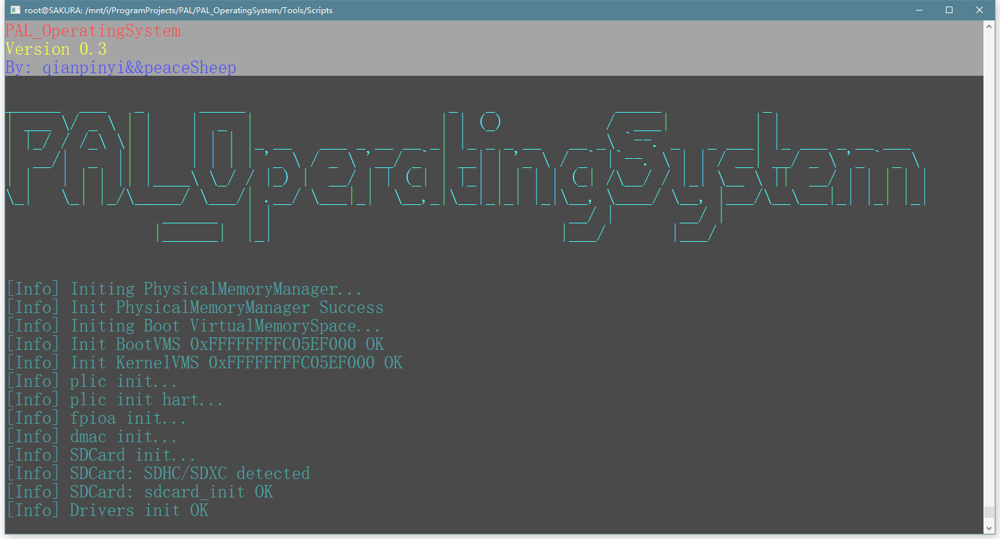

# 系统信息

### 名称：PAL_OperatingSystem

### 开发者：qianpinyi、PeaceSheep

#### 开发者邮箱：<qianpinyi@outlook.com> 、 <1553770945@qq.com>

#### 当前版本：0.4

#### 开发日期：22.4.27~22.6.5

--------

# 文档目录

### 0x00 概述

​		即该文档，描述了目录、作者等整体性的内容。

#### 0x01 设计思路

​		OS设计过程中的思路和个人偏好等。

#### 0x02 系统整体框架

​		到目前阶段系统的整体框架结构。

### 0x10 心得体会(qianpinyi)

​		qianpinyi开发前后的心得体会。

### 0x11 心得体会(PeaceSheep)

​		PeaceSheep开发前后的心得体会。

#### 0x12 开发进度记录

​		从开始写代码到撰写该文档中途的开发进度历程。

#### 0x13 遇到的瓶颈和解决方案

​		开发过程中遇到的一些瓶颈、问题以及其解决方案，有需要的同学或许可以从中获得启发。

#### 0x14 调试经历经验记录

​		一些调试的经验和经历的记录。

#### 0x15 后续路线

​		系统中尚不完善的内容、后续需要改进的地方，以及未来准备实现的内容。

### 0x20 系统启动

​		系统启动相关实现文档，包括启动代码，初始化流程等。

#### 0x21 中断与异常

​		中断与异常的相关实现文档，包括中断与异常的接收与分发、陷入时保存恢复现场等。

### 0x30 进程管理

​		进程管理概览文档，介绍了整体性的设计思路和结构，描述了进程结构体(类)。

#### 0x31 进程对象

​		详细描述了进程对象的组成与设计的文档。

#### 0x32 进程切换

​		进程切换、执行、启动方面的实现文档。

#### 0x33 同步原语

​		自旋锁、信号量及其拓展功能的实现文档。

#### 0x34 ELF文件解析

​		ELF格式文件解析并与本系统对接的实现文档。

### 0x40 内存管理

​		内存管理概览文档，介绍了整体性的设计思路和结构。

#### 0x41 物理内存

​		物理内存分配器的设计与实现文档，包括空闲链表和类似伙伴系统两种实现。

#### 0x42 虚拟内存

​		虚拟内存管理实现文档，包括页表、页表项、虚拟内存空间、虚拟内存区域、缺页中断处理、内存拷贝等。

### 0x50 文件系统

​		文件系统概览文档，介绍了整体性的设计思路和结构。

#### 0x51 虚拟文件系统

​		虚拟文件系统的设计文档，虚拟文件系统是对各类文件系统的抽象，便于隔离各个模块，屏蔽具体实现差异。此外，还介绍了虚拟文件系统管理器和文件结点的设计，虚拟文件系统管理器是全局的对虚拟文件系统进行管理的类，负责全局目录树的管理。

#### 0x52 特殊文件

​		包括标准输入输出文件、管道文件、内存映射文件、内存文件等特殊类型文件的设计文档。

#### 0x53 文件句柄

​		文件句柄的设计文档，文件句柄是进程操作文件的接口。

#### 0x54 FAT32文件系统

​		FAT32文件系统的具体实现文档。

### 0x60 系统调用

​		系统调用整体结构上的设计实现。

#### 0x61 系统调用具体实现

​		比赛相关的具体每一个系统调用的设计实现文档。

### 0x70 设备管理

​		介绍了设备管理相关的实现方案的文档。

### 0x80 基础设施库

​		开发过程中使用了很多开发应用、底层都会用到的基础设施库，以及一些共性的内容，进行相关描述的文档。

#### 0x81 系统输出KOUT

​		KOUT是类似于cout 的输出流类，并对其进行了各方面的强化，文档介绍使用方式以及实现方法。

#### 0x82 模板工具箱

​		C++模板实现的各类便利的工具。

#### 0x83 字符串工具

​		字符串相关的工具。

---------

# 开源协议

--------------

# 致谢

​		本系统的实现参考和学习了包括XV6、XV6-K210、rCore、uCore等系统，非常感谢这些先驱者们提供的宝贵教程与文档。

​		对于本次比赛的指导老师，非常感谢来自南京航空航天大学的刘亮和朱小军老师，我们上了这两位老师的课程，并在比赛过程中获得了他们的指导和帮助。

​		另外，非常感谢我们计算机组成原理的冯爱民老师，她让我们了解到这个比赛，并且也在比赛过程中提供了关于Riscv等方面的指导和帮助。也非常感谢我们C++程序设计的皮德常老师，他给我们提供了最初写操作系统的想法方面的指导。

​		此外，非常感谢组委会提供了这样一个学习和展示自我的平台，感谢群内提供帮助的老师和同学们。

--------------

By：qianpinyi

2022.06.04

