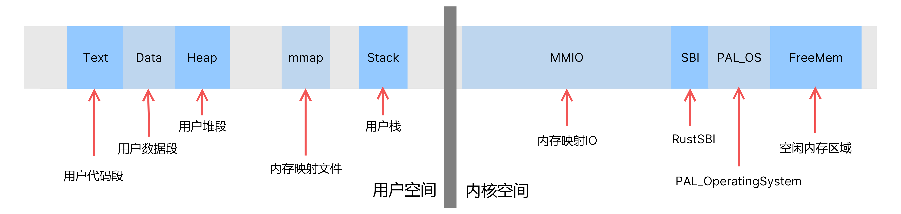

# 内存管理

​		进程管理是对CPU的管理，而内存管理则是对另一个重要部件即内存的管理。事实上物理内存管理和虚拟内存管理虽然都属于内存管理，不过它们之间的关系并不紧密，个人感受的开发顺序可以是，首先有一个能用的物理内存分配器，然后就可以虚拟内存和物理内存管理分开来各自做各的了。

#### 物理内存管理设计

​		物理内存管理部分的核心想法就是给了一个连续的空闲区间，如何应对系统的请求，分配内存区间，即对Kmalloc和Kfree的实现了。这一部分由李亚宁同学完成。我们首先设计了空闲链表的内存分配器，有了可用的动态内存分配方案，才能继续后续的开发。随后实现了类似于伙伴系统的内存分配方案。

​		物理内存管理器部分的主要是提供了一些内存布局的定义，以及两个重要的类为：物理页面（Page），物理内存管理器（PhysicalMemoryManger，简称PMM）。物理页是对页框进行管理的类，PMM是对整个物理空闲内存区间进行管理的，具体的实现见0x41物理内存文档。

#### 虚拟内存管理设计

​		虚拟内存部分由主要由三个类/结构体进行控制，分别为虚拟内存空间（Virtual Memory Space，简称VMS），虚拟内存区域（Virtual Memory Region，简称VMR），页表（PageTable）。

​		VMS对某个虚拟地址空间进行管理，是虚拟内存中最重要的类，一个VMS拥有一个根页表（PDT），以及若干VMR串成的链表。VMR表示的是VMS中的某个合法区间，对其属性进行标记，进行权限检查、创建销毁、复制等控制。页表是根据K210的SV39分页机制设计的结构体，主要设计目的是为控制页表提供良好易用的接口。

​		设计理念上来看，VMS的存在不依赖于进程，并可以同时给多个进程共享使用，不过一般一个VMS对应一个进程的情况是最多见的。

​		此外，包括内存映射文件、MMIO区域等的控制也是通过VMR进行管理的，总而言之，只要是涉及地址空间上的操作，都是虚拟内存管理的工作。

#### 内存空间布局

​		K210开发板的物理内存布局为：0x80000000前为MMIO的区域，0x80000000~0x80020000为RustSBI的区域，0x80020000~0x80600000为PAL_OS以及空闲内存区域。

​		我们的虚拟地址空间布局为，首先将整个开发板所占的3个大页映射到虚拟地址的最高3个大页，然后低地址空间是用户的地址空间，目前各段加载位置还是根据ELF要求的来，一般占据较低的虚拟内存位置，用户栈的顶部放在虚拟地址空间的0x80000000，向下长4个页的大小。从0x60000000开始的一片区域，是内存映射文件的映射区域。

示意图如下：

#### 内存布局图

------------------

By：qianpinyi

2022.06.05